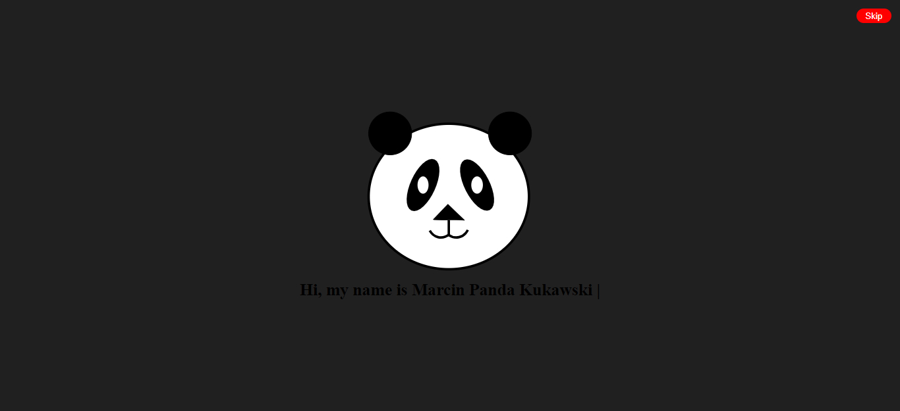
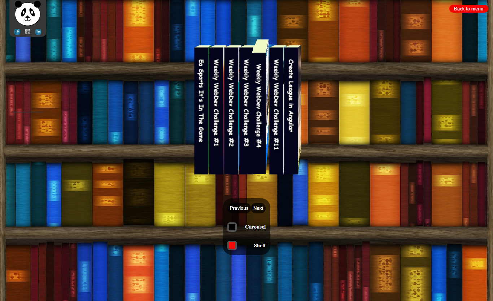

# Portfolio - cookavsky
Presentation of myself and my knowledge. Currently builded with simple HTML, CSS, JS.

## Getting Started
It does not have any requirements. The principle of "copy, paste". With the time of acquiring new knowledge to the portfolio, I trying to add something new. Still in progress. The best element of the portfolio is the first page and the presentation of projects. I want achieve a satisfactory effect of the so-called "Beautiful".

## Screenshots

## Technologies
* HTML
* CSS
* JS
* PHP

## Acknowledgments
#### Console text
#### Inspiration : https://codepen.io/LeandroPeres/pen/bEaWaZ

Simple code:
######Two position
*One = Generate Text: counter add number and Text inner in HTML slice(0, x). When counter = innerHTML, change position to 1;
*Two = counter subtract number, Text is remove this same fuction slice(0, x). When counter have 0, changing position and index. When index is 4,
the function switches off.

Two = DeleteText

headerText = Array;
`if (position === 0) {
        window.setTimeout(() => {
            counter++;
            Text.innerHTML = headerText[index].slice(0, counter);
        },300);
        if (counter === headerText[index].length) {
            position = 1;
        }
    } else if (position === 1) {
        counter--;
        Text.innerHTML = headerText[index].slice(0, counter);
        if (counter === 0) {
            position = 0;
            index++;
            if (index === 4) {
                index = 0;`

#### Carousel + Shelf
#### Inspiration : https://3dtransforms.desandro.com/

Shelf: in brief (
    transform: rotateX(x) translateZ(x);
    perspective: 30em;
    perspective-origin: 100% 100%;
    transform-style: preserve-3d;
    )

Carousel:
Button click switch rotateY(' + angle + 'deg) and translateZ(x) all elements. blockfinish is sum number project in Carousel.

let blockfinish = 7;
let blockstart = 0;
`   for (let i = 0; i < Previous.length; i++) {
        Previous[i].addEventListener("click", () => {
            blockstart--;
            let angle = blockstart / blockfinish * -360;
            block[0].style.transform = 'rotateY(' + angle + 'deg) translateZ(14em)';
            block[1].style.transform = 'rotateY(' + (angle + 51.42) + 'deg) translateZ(14em)';
            block[2].style.transform = 'rotateY(' + (angle + 102.84) + 'deg) translateZ(14em)';
            block[3].style.transform = 'rotateY(' + (angle + 154.26) + 'deg) translateZ(14em)';
            block[4].style.transform = 'rotateY(' + (angle + 205.68) + 'deg) translateZ(14em)';
            block[5].style.transform = 'rotateY(' + (angle + 257.1) + 'deg) translateZ(14em)';
            block[6].style.transform = 'rotateY(' + (angle + 308.52) + 'deg) translateZ(14em)';
        })
    }
    for (let a = 0; a < Next.length; a++) {
        Next[a].addEventListener("click", () => {
            blockstart++;
            let angle = blockstart / blockfinish * -360;
            block[0].style.transform = 'rotateY(' + angle + 'deg) translateZ(14em)';
            block[1].style.transform = 'rotateY(' + (angle + 51.42) + 'deg) translateZ(14em)';
            block[2].style.transform = 'rotateY(' + (angle + 102.84) + 'deg) translateZ(14em)';
            block[3].style.transform = 'rotateY(' + (angle + 154.26) + 'deg) translateZ(14em)';
            block[4].style.transform = 'rotateY(' + (angle + 205.68) + 'deg) translateZ(14em)';
            block[5].style.transform = 'rotateY(' + (angle + 257.1) + 'deg) translateZ(14em)';
            block[6].style.transform = 'rotateY(' + (angle + 308.52) + 'deg) translateZ(14em)';
        })
    }`

## Status
In progress.

## Author
Created by [cookavsky](https://www.cookavsky.com/) - for friends Polska Panda.
